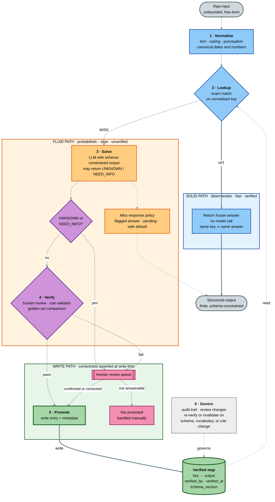
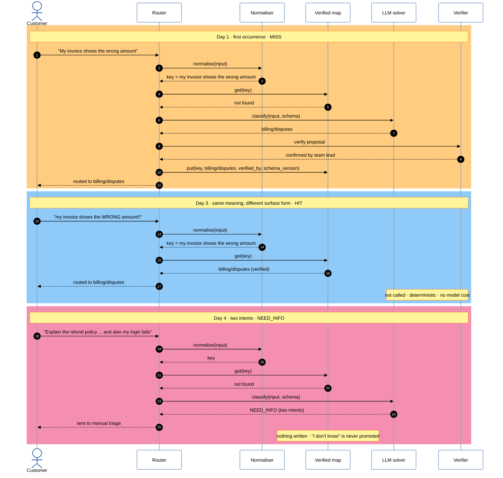
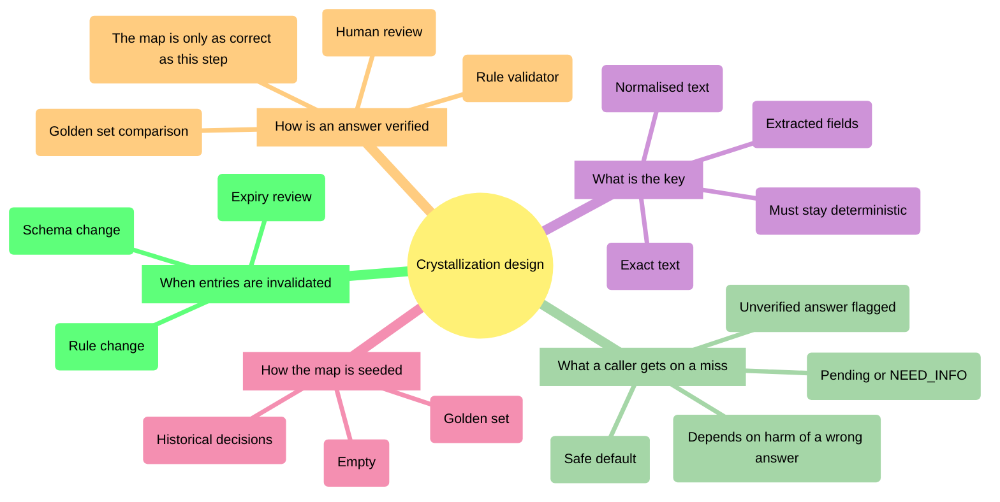
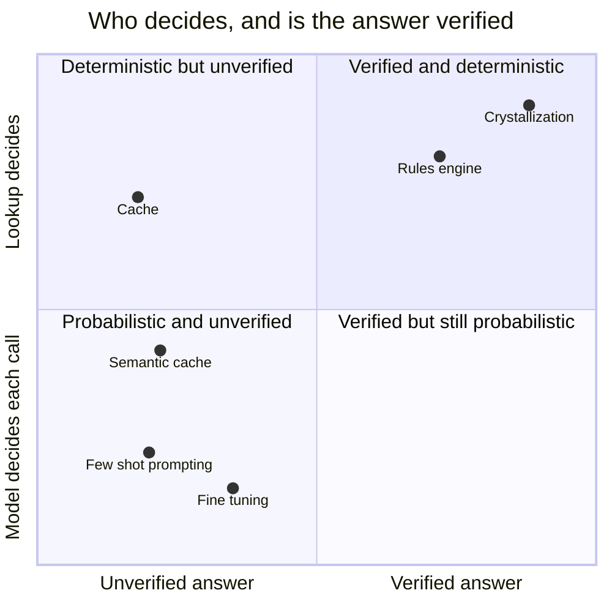

# The Crystallization Pattern — Diagrams

Visual companion to [The Crystallization Pattern](crystallization-pattern.md).

| #   | Diagram                                                           | Answers                                                  |
| --- | ----------------------------------------------------------------- | -------------------------------------------------------- |
| 1   | [Architecture and control flow](#1-architecture-and-control-flow) | How does a request move through the system?              |
| 2   | [Request lifecycle over time](#2-request-lifecycle-over-time)     | What happens on a miss, a hit, and an "I don't know"?    |
| 3   | [Design decisions](#3-design-decisions)                           | What must be decided before building it?                 |
| 4   | [Position among similar ideas](#4-position-among-similar-ideas)   | How is it different from a cache, fine-tuning, or rules? |

---

## 1. Architecture and control flow

The verified map is the source of truth. The solver sits behind it and is reached only on a
miss. Nothing enters the map without passing verification.

**Reading it:** blue is deterministic, orange is probabilistic, purple is a check, green is
the authoritative store, pink involves a person. Thick arrows are the paths that matter most:
the hit path and the write-back.

---

## 2. Request lifecycle over time

The support-ticket example from the pattern, shown as three requests on different days.

---

## 3. Design decisions

The five decisions from the pattern's design table. Each one must be answered before the
map can be trusted.

---

## 4. Position among similar ideas

> **Qualitative positioning**, based on the "What it is not" table in the pattern.

Crystallization and a hand-written rules engine sit in the same quadrant. The difference is
where entries come from: rules are written up front by people, while crystallized entries are
discovered by the model from real traffic and confirmed by people.
